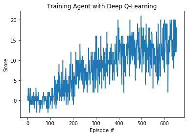

# Project: Navigation

This project consists on training an agent to collect bananas in a 2D world (limited in a square). For this implementation I chose to not to follow tightly the initial implementation of Deep Q-Learning from other projects. More precisely, I didn't reuse most of the code from the solution provided on LunarLander-v2.

## Introduction of the environment

The unity environment consists on an agent that is moving in a 2D (square) world with bananas are dropping. These bananas can be of two colors: yellow and blue. The agent receives a reward of +1 if it collects a yellow banana and a reward of -1 if it collects a blue banana.

The goal of the project is to train an agent that gets an average score of +13 over the last 100 episodes.

### Actions

The agent can perform 4 discrete actions:

- 0: move forward.
- 1: move backward.
- 2: turn left.
- 3: turn right.

### State

We can use different states for this project (images the agent sees or 37 dimensions containing different properties like position or speed). For this first implementation I used the 37 dimensions for simplicity. Processing the images would require processing the images, and changing the network used (probably a couple of CNN layers similar to DeepMind's approach to solve Atari games).

## Implementation

The core of the project is implemented in "Navigation DQN.ipynb". This code initializes the required variables and trains the model using some dependency injection to facilitate (future) testing and reusability. The main idea is to make it easier to implement multiple agents and Network structure and avoid modifying the rest of the code.

### Agent

The agent is actually a simple Deep Q-Learning without any improvements: no double or dueling DQN. The only improvement used by the agent was an Experience Replay, that kept up to 10K samples and random sample 64 of those for each iteration. While I used multiple of 2s for those (64 samples used and training every 4 time steps), there is no strict requirement. The training took quite a bit and I didn't experiment too much with thos hyperparameters (with 64 and 4 it takes 14'30") in my desktop.

The agent uses a epsilon-greedy strategy to select the action (to navigate the exploration vs explotation dilemma). This epsilon is provided to the agent to compute the next action: the agent is agnostic to how this epsilon is computed.

The way the epsilon-greedy strategy works is quite simple: we sample a uniform random sample between [0,1], and if that value is higher than epsilon, we choose the action that we estimate give the maximum reward. Otherwise we choose a random action. In other words, a small epsilon means the agent will choose greedily (exploitation) while a large epsilon means the agent will explore randomly (exploration). We could probably improve this by giving higher probability of exploration to those actions (per state) that we have not explore enough.

Similarly, the Agent consumes a replay_buffer; ideally the Agent should be agnostic to the strategy used by the ReplayBuffer (not knowing and not caring about the batch size, for example. But after some environment incompatibility I decided to keep the same ReplayBuffer as provided.

For the optimization of te model, I tried a couple of different optimizers, with similar results (in this case, Adam with learning rate of 0.0005 and RMSprop).

Finally, we train minimizing the MSE from the usual formula: reward + gamma * q(max_action) - q(next_action). We do this for the whole batch we obtain from the ReplayBuffer.

### ReplayBuffer

I had a few issues here, because the expected samples were in some specific types and doing the required transforms ended up being troublesome, so I resorted to using the same ReplayBuffer than in LunarLander-v2.

### Modeling

The model for this solution (DQN.py) is quite simple: we use a 3 layer FC NN with decreasing number or output layers: 64 -> 32 -> 4 (where 4 is hte number of actions), with relu's in between.

As mentioned before, this would change if we used the view of the agent as the state (so we would have images and CNN's would give better performance). 

## Results

The following results show how the network learned over time:

## Next steps

The implementation is pretty simple, using only experience replay to improve the results. Next implementations to try:

- Double DQN.
- Dueling DQN.
- Using images (view from agent).

## Issues during the project

- Could not take a video because the environment does not open in windows mode.
- Had to reuse the ReplayBuffer code; the expected values for the states, actions, rewards was fixed in the environment, and any other solution ended up being too complex.

